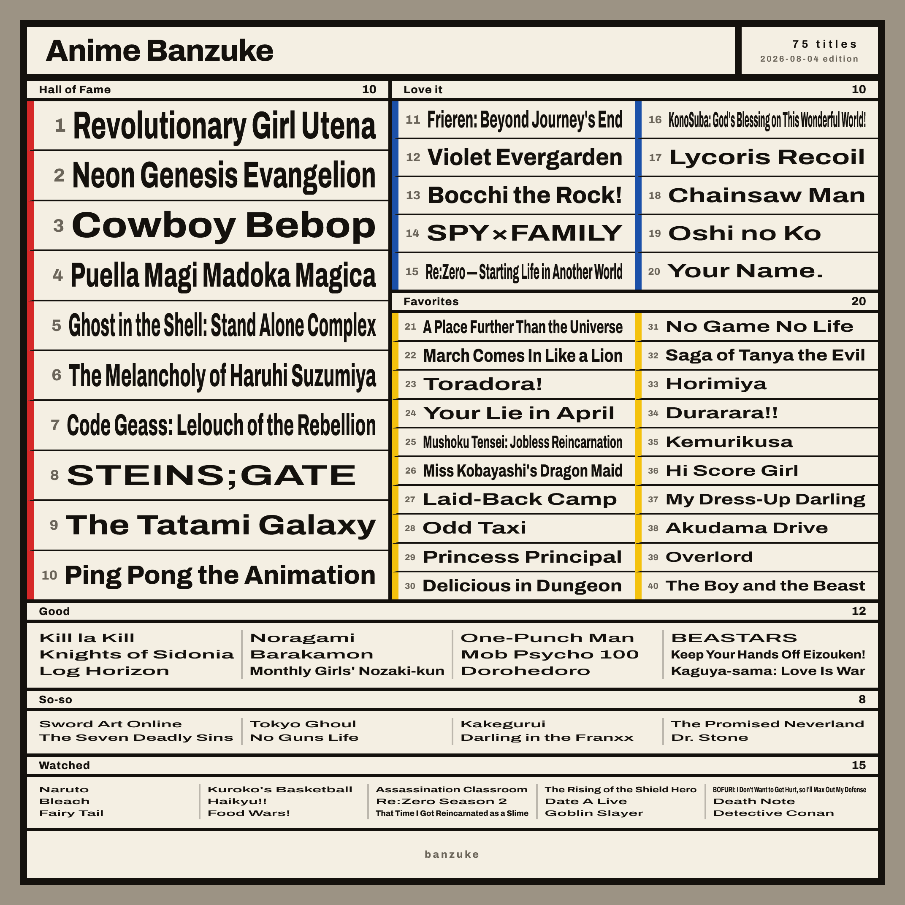
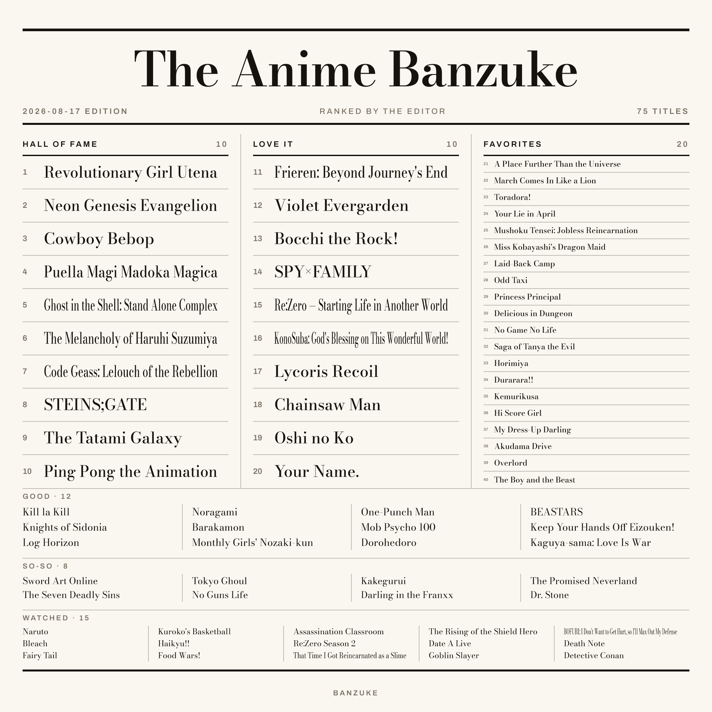
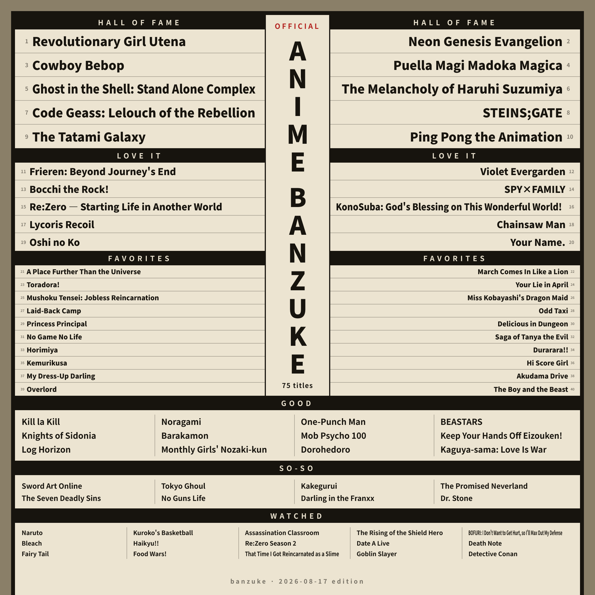
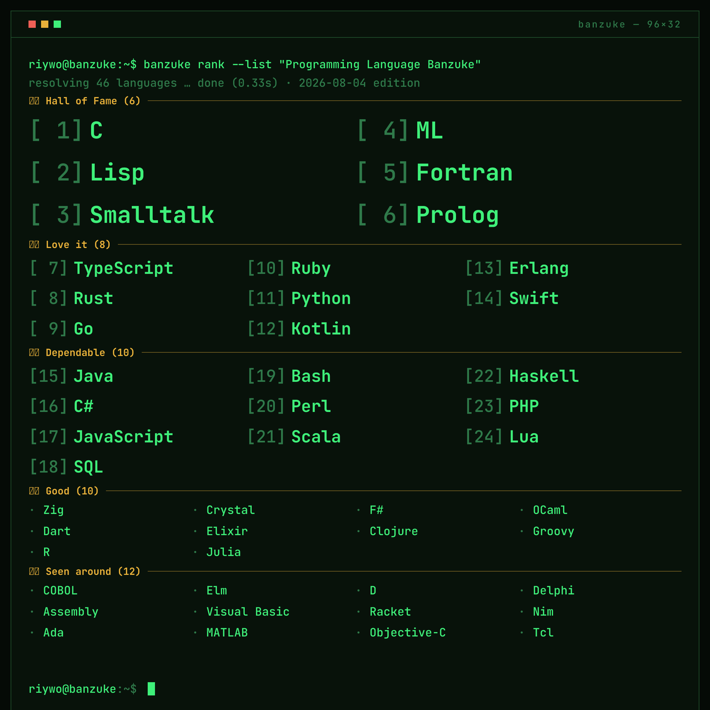
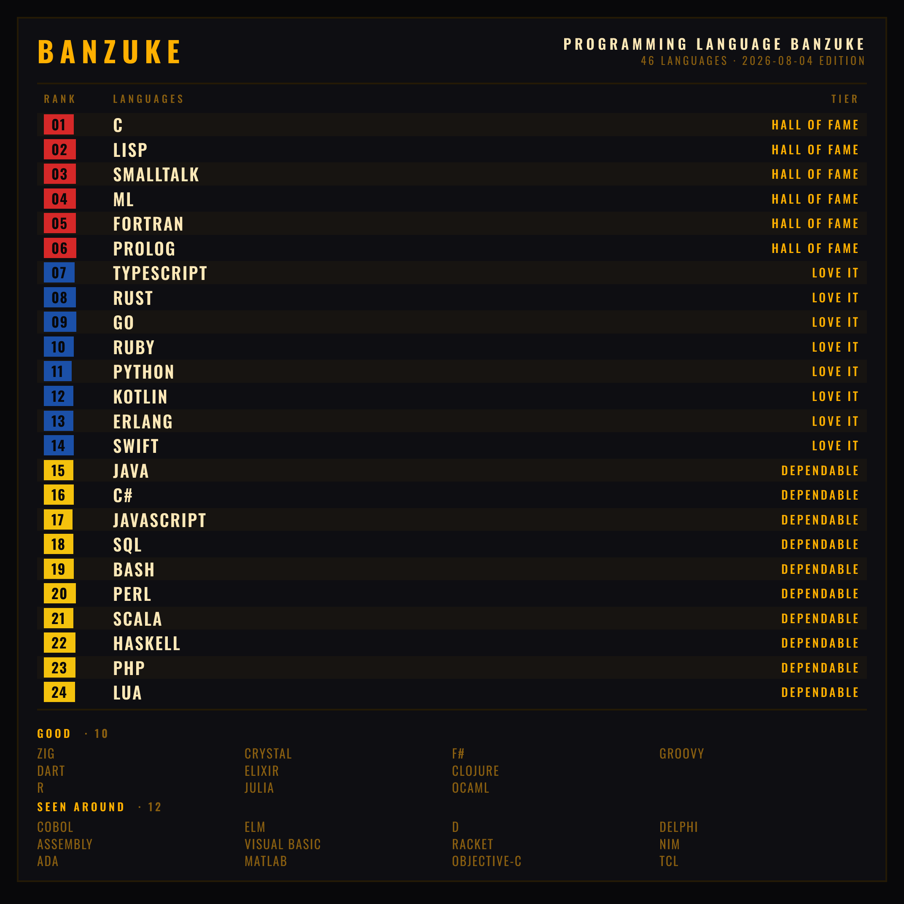
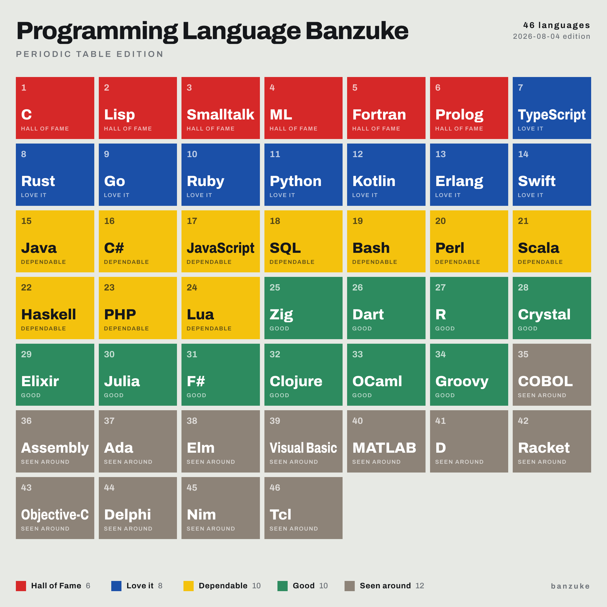

# banzuke 番付

An Agent Skill that generates and updates banzuke (tier-list ranking) PNG sheets.
Just tell your agent "I want to make a banzuke" and it runs the whole loop:
edit the data → render → eyeball → fine-tune.

> **番付** (*banzuke*) is the ranking sheet of Japanese sumo: every wrestler for the coming
> tournament printed on a single page, the top ranks in the largest type and each tier below
> them smaller, east and west facing off across the sheet. Japan has borrowed the format for
> centuries to rank anything at all — and so does this skill.

Same data, any theme and layout you like (Bauhaus newsprint / broadsheet gazette / sumo banzuke):

<p>
  <a href="samples/anime.png"></a>
  <a href="samples/gazette.png"></a>
  <a href="samples/sumo.png"></a>
</p>

Swap the data and it ranks anything (CRT terminal / departure board / periodic table):

<p>
  <a href="samples/crt.png"></a>
  <a href="samples/board.png"></a>
  <a href="samples/tiles.png"></a>
</p>

Every sample is a plain script under [samples/build/](samples/build) — `npm run samples` rebuilds them.

## Install

```bash
npx skills add riywo/banzuke
```

Drops the skill into the project's `.agents/skills/`, which covers most agents
(`-g` for global, `--agent <id>` to target a specific one).

Claude Code can install it as a plugin instead:

```
/plugin marketplace add riywo/banzuke
/plugin install banzuke@banzuke
```

**claude.ai:** download
[`banzuke.zip`](https://github.com/riywo/banzuke/releases/latest/download/banzuke.zip)
and upload it under Settings → Capabilities → Skills. That zip is rebuilt from `main` on
every push, so the link always points at the current skill.

**Anything else:** the skill is just the [`skills/banzuke/`](skills/banzuke) directory — copy it
wherever your agent looks for skills. [agentskills.io/clients](https://agentskills.io/clients)
lists the agents that support Agent Skills and links to each one's setup docs.

> Needs node (>=22), bun (>=1.2) or deno (>=2) wherever it runs — the scaffold ships a lockfile
> for each, and CI renders a sheet on all three. If none is installed, the agent will walk you
> through it.

## How it works

Curious what happens between your request and the rendered PNG?
[docs/architecture.md](docs/architecture.md) walks through the pieces — none of it is needed to
use the skill.
